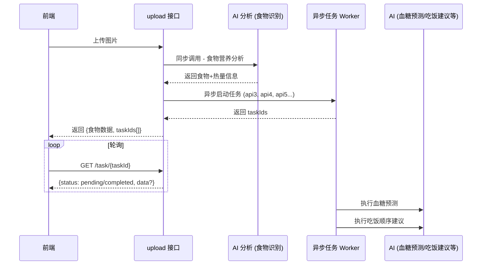

# FlowService 异步 API 改造总结

## 📋 改造概述

本次改造将 `/record/upload` 接口从纯同步模式升级为 **同步 + 异步** 混合模式，以优化用户体验，减少长时间等待。

### 改造背景

- AI 请求耗时较长（3-10秒），用户等待体验差
- 新增功能（血糖趋势预测、吃饭顺序建议）需要额外的 AI 调用
- 需要实现渐进式加载，让用户先看到核心信息

### 改造目标

1. 用户上传图片后，**快速返回**食物识别和营养分析结果
2. 后续的 AI 分析任务**异步执行**，前端通过轮询获取结果
3. 架构支持**水平扩展**，便于后续新增更多异步任务类型

---

## 🏗️ 架构设计

### 时序图



### 核心组件

| 组件 | 文件 | 职责 |
|------|------|------|
| **AsyncTaskInfo** | `model/AsyncTaskInfo.java` | 异步任务信息模型，包含状态枚举和任务类型枚举 |
| **UploadResponse** | `model/UploadResponse.java` | Upload 接口新响应结构，包含同步结果和异步任务映射 |
| **AsyncTaskStorageService** | `service/AsyncTaskStorageService.java` | 任务状态存储服务（内存实现，可替换为 Redis） |
| **AsyncTaskExecutorService** | `service/AsyncTaskExecutorService.java` | 异步任务执行服务，使用 `@Async` 注解 |
| **AsyncTaskController** | `controller/AsyncTaskController.java` | 任务状态查询接口 |
| **AsyncConfig** | `config/AsyncConfig.java` | 异步线程池配置 |

---

## 📡 API 变更

### Upload 接口

**路径**: `POST /record/upload`

**请求**: 保持不变

**响应结构变更**:

```json
{
  "code": 200,
  "message": "食物分析成功",
  "data": {
    "analysisResult": {
      "foodName": "双层芝士汉堡",
      "foods": [...],
      "nutrition": {...},
      "confidence": 0.95,
      "isBalanced": false,
      "nutritionSummary": "热量偏高，建议搭配蔬菜"
    },
    "asyncTasks": {
      "glucoseTrend": "uuid-for-glucose-trend-task",
      "eatingOrder": "uuid-for-eating-order-task"
    },
    "mealRecordId": 123
  }
}
```

### 新增：任务状态查询接口

**路径**: `GET /task/{taskId}`

**响应**:

```json
{
  "code": 200,
  "message": "查询成功",
  "data": {
    "taskId": "uuid-xxx",
    "taskType": "GLUCOSE_TREND",
    "status": "COMPLETED",
    "result": {
      "peakValue": 7.8,
      "peakTime": "餐后 30-60 分钟",
      "trendData": [5.5, 6.2, 7.8, 7.2, 6.5, 5.8]
    },
    "createdAt": "2025-12-28T19:00:00",
    "completedAt": "2025-12-28T19:00:05"
  }
}
```

### 新增：批量查询接口

**路径**: `GET /task/batch?taskIds=id1,id2,id3`

---

## 🔧 任务状态

| 状态 | 说明 |
|------|------|
| `PENDING` | 等待执行 |
| `RUNNING` | 执行中 |
| `COMPLETED` | 已完成（result 字段包含结果） |
| `FAILED` | 执行失败（errorMessage 字段包含错误信息） |
| `CANCELLED` | 已取消 |

## 📦 任务类型

| 类型 | 代码 | 说明 |
|------|------|------|
| `GLUCOSE_TREND` | `glucoseTrend` | 血糖趋势预测 |
| `EATING_ORDER` | `eatingOrder` | 吃饭顺序建议 |
| `HEALTH_SCORE` | `healthScore` | 健康评分分析（预留） |

---

## 🚀 前端对接指南

### 1. 调用 Upload 接口

```swift
// 上传图片
let response = await api.upload(image: imageData, userId: userId)

// 获取同步返回的食物分析结果
let analysisResult = response.analysisResult
showFoodAnalysis(analysisResult)

// 获取异步任务 ID
let asyncTasks = response.asyncTasks
```

### 2. 轮询异步任务

```swift
// 轮询血糖趋势任务
if let glucoseTaskId = asyncTasks["glucoseTrend"] {
    pollTask(taskId: glucoseTaskId) { result in
        showGlucoseTrend(result)
    }
}

// 轮询吃饭顺序建议任务
if let eatingOrderTaskId = asyncTasks["eatingOrder"] {
    pollTask(taskId: eatingOrderTaskId) { result in
        showEatingOrderTips(result)
    }
}
```

### 3. 推荐轮询策略

- **轮询间隔**: 1-2 秒
- **最大轮询次数**: 30 次（约 30-60 秒超时）
- **任务完成后**: 立即停止轮询，展示结果

---

## ⚠️ 注意事项

1. **任务过期**: 任务信息默认保留 24 小时后自动清理
2. **任务存储**: 当前使用内存存储，服务重启后任务丢失；生产环境建议使用 Redis
3. **线程池**: 异步任务线程池配置为核心 5 线程、最大 10 线程、队列容量 25
4. **模拟数据**: 当前异步任务返回模拟数据，后续需要对接真实 AI 服务

---

## 📁 新增/修改文件清单

### 新增文件

| 文件 | 说明 |
|------|------|
| `model/AsyncTaskInfo.java` | 异步任务信息模型 |
| `model/UploadResponse.java` | Upload 响应结构 |
| `model/FoodAnalysisProcessResult.java` | 处理结果包装类 |
| `service/AsyncTaskStorageService.java` | 任务存储服务 |
| `service/AsyncTaskExecutorService.java` | 任务执行服务 |
| `controller/AsyncTaskController.java` | 任务查询控制器 |
| `config/AsyncConfig.java` | 异步配置 |

### 修改文件

| 文件 | 说明 |
|------|------|
| `FlowServiceApplication.java` | 添加 `@EnableAsync` 和 `@EnableScheduling` |
| `controller/RecordController.java` | `uploadImage` 方法重构 |
| `service/ImageProcessService.java` | 新增 `processFoodAnalysisWithRecordId` 方法 |

---

## 🔮 后续优化建议

1. **Redis 存储**: 生产环境替换为 Redis 存储任务状态
2. **SSE 推送**: 如任务数量增多，可升级为 Server-Sent Events
3. **消息队列**: 考虑引入 RabbitMQ/Kafka 实现更可靠的任务分发
4. **任务重试**: 实现失败任务的自动重试机制
5. **监控告警**: 添加任务执行时间和失败率监控
